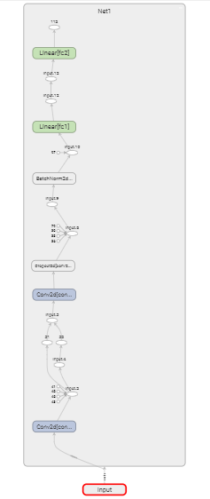

# 11.1.1 训练监控

tensorboard的另一个实用的功能是可视化计算图，方便我们检测网络结构并进行调整

本小节给出一个demo，通过构造一个简易的神经网络，来介绍如何通过tensorboardX可视化计算图。

直接看代码：

```python
import torch
import torch.nn as nn
import torch.nn.functional as F
from tensorboardX import SummaryWriter

class Net1(nn.Module):
    def __init__(self):
        super(Net1, self).__init__()
        self.conv1 = nn.Conv2d(1, 10, kernel_size=5)
        self.conv2 = nn.Conv2d(10, 20, kernel_size=5)
        self.conv2_drop = nn.Dropout2d()
        self.fc1 = nn.Linear(320, 50)
        self.fc2 = nn.Linear(50, 10)
        self.bn = nn.BatchNorm2d(20)

    def forward(self, x):
        x = F.max_pool2d(self.conv1(x), 2)
        x = F.relu(x) + F.relu(-x)
        x = F.relu(F.max_pool2d(self.conv2_drop(self.conv2(x)), 2))
        x = self.bn(x)
        x = x.view(-1, 320)
        x = F.relu(self.fc1(x))
        x = F.dropout(x, training=self.training)
        x = self.fc2(x)
        x = F.softmax(x, dim=1)
        return x

dummy_input = torch.rand(13, 1, 28, 28)

model = Net1()
with SummaryWriter(comment='Net1') as w:
    w.add_graph(model, (dummy_input,))
```

运行上面代码，并启动tensorboard：

```
$ python graph_model.py 
$ tensorboard --logdir runs --bind_all
```

在浏览器输入ip:port即可查看计算图的可视化结构:

```
ip:6006
```


