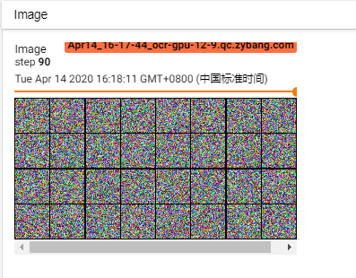
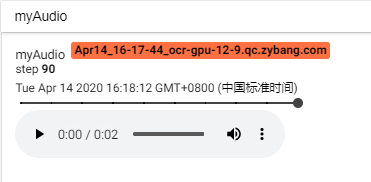
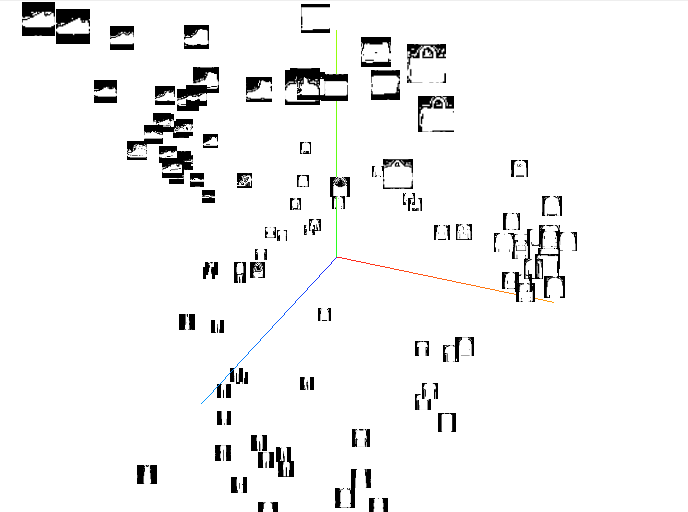

# 11.1 tensorboardX

我们知道tensorflow框架有一个非常实用的可视化工具tensorboard。

Github上的一个优秀项目 [tensorboardX](https://github.com/lanpa/tensorboardX)为我们在Pytorch中使用tensorboard这一套完美的可视化工具提供了解决方案。

TensorboardX支持scalar, image, figure, histogram, audio, text, graph, onnx_graph, embedding, pr_curve, videosummaries等不同的可视化展示方式








这里介绍如何安装tensorboardX，并给出[tensorboardX](https://github.com/lanpa/tensorboardX)的官方demo

如果你只对某些独立的可视化功能感兴趣，可参见以下demo：

如何监控训练，见`11.1.1_training_monitor`

如何可视化计算图，见`11.1.2_visual_computational_graph`


## tensorboardX安装

install tensorboardX:

```shell
$ pip install tensorboardX
$ pip install tensorflow==1.14
```

## tensorboardX使用

当你已经通过代码生成可视化信息后，通过如下命令运行tensorboard：

```
$ tensorboard --logdir runs
```

如果不能成功，尝试

```
$ tensorboard --logdir runs --bind_all
```

在浏览器输入ip:port即可查看可视化信息:

```
ip:6006
```

## 官方示例

如下是tensorboardX给出的demo，包含了多种可视化功能的使用示例

```python
# -*- coding: utf-8 -*-
"""
Created on Thu Feb 20 22:00:49 2020

official demo to use tensorboardX

@author: lanpa(https://github.com/lanpa)
"""
import torch
import torchvision.utils as vutils
import numpy as np
import torchvision.models as models
from torchvision import datasets
from tensorboardX import SummaryWriter

resnet18 = models.resnet18(False)
writer = SummaryWriter()
sample_rate = 44100
freqs = [262, 294, 330, 349, 392, 440, 440, 440, 440, 440, 440]

for n_iter in range(100):

    # 定义两个模拟变量，可以理解为充当每个batch的loss和acc的作用
    dummy_s1 = torch.rand(1)
    dummy_s2 = torch.rand(1)

    # add_scalar 来记录标量随着迭代的变化曲线
    # data grouping by `slash`  使用'/'来分组
    writer.add_scalar('data/scalar1', dummy_s1[0], n_iter)
    writer.add_scalar('data/scalar2', dummy_s2[0], n_iter)

    # add_scalars 来同时记录多个标量随着迭代的变化曲线
    writer.add_scalars('data/scalar_group', {'xsinx': n_iter * np.sin(n_iter),
                                             'xcosx': n_iter * np.cos(n_iter),
                                             'arctanx': np.arctan(n_iter)}, n_iter)

    # 模拟 output from network
    dummy_img = torch.rand(32, 3, 64, 64)
    if n_iter % 10 == 0:
        x = vutils.make_grid(dummy_img, normalize=True, scale_each=True)
        writer.add_image('Image', x, n_iter)

        dummy_audio = torch.zeros(sample_rate * 2)
        for i in range(x.size(0)):
            # amplitude of sound should in [-1, 1]
            dummy_audio[i] = np.cos(freqs[n_iter // 10] * np.pi * float(i) / float(sample_rate))
        writer.add_audio('myAudio', dummy_audio, n_iter, sample_rate=sample_rate)

        writer.add_text('Text', 'text logged at step:' + str(n_iter), n_iter)

        for name, param in resnet18.named_parameters():
            writer.add_histogram(name, param.clone().cpu().data.numpy(), n_iter)

        # needs tensorboard 0.4RC or later
        writer.add_pr_curve('xoxo', np.random.randint(2, size=100), np.random.rand(100), n_iter)

# get a MNIST dataset
# MNIST and FashionMNIST is both 28 * 28 shape image dataset
dataset = datasets.FashionMNIST('../../dataset', train=False, download=True)
images = dataset.test_data[:100].float()
label = dataset.test_labels[:100]

features = images.view(100, 784)
writer.add_embedding(features, metadata=label, label_img=images.unsqueeze(1))

# export scalar data to JSON for external processing
writer.export_scalars_to_json("./all_scalars.json")
writer.close()
```
